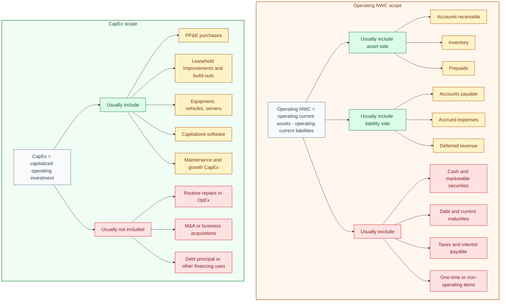
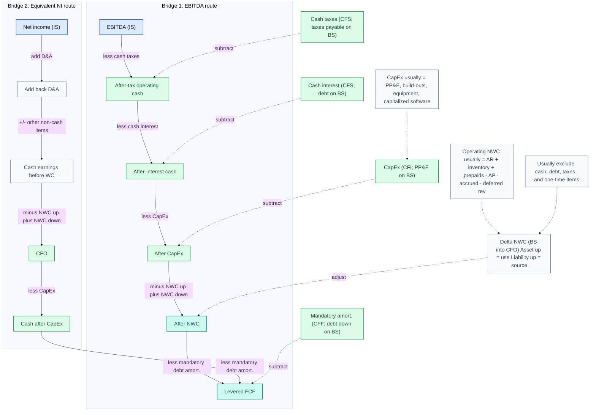
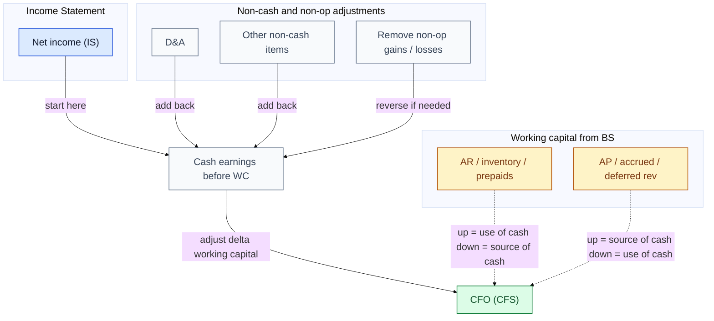
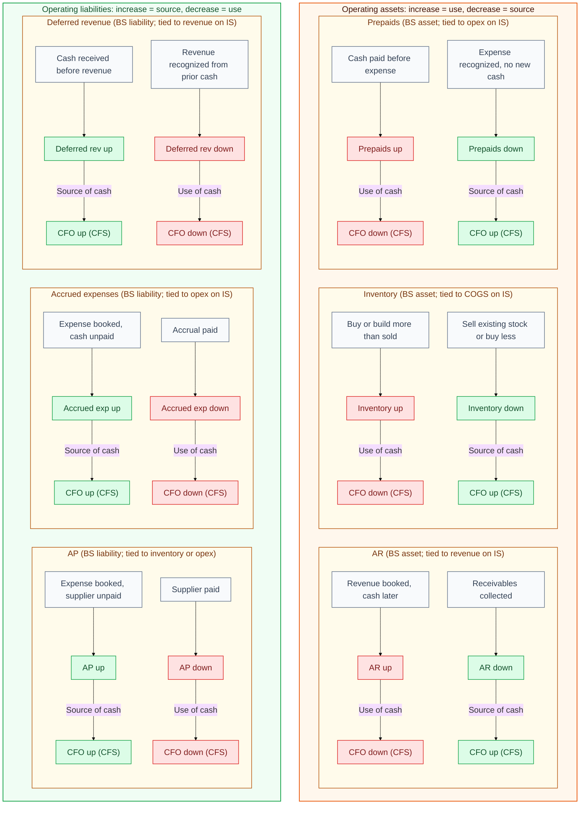
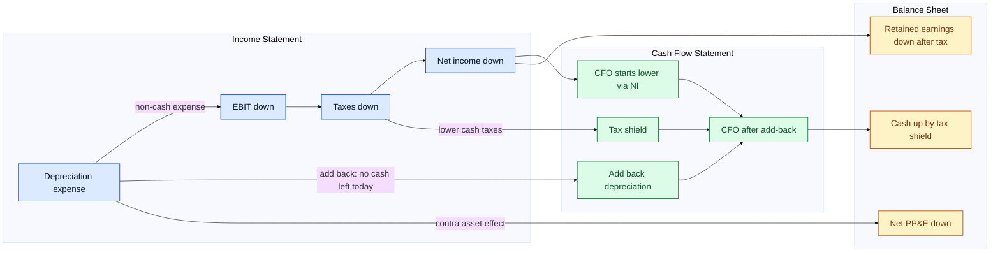
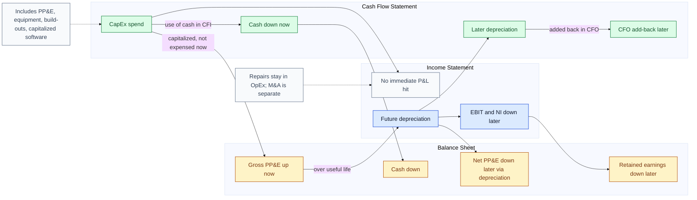
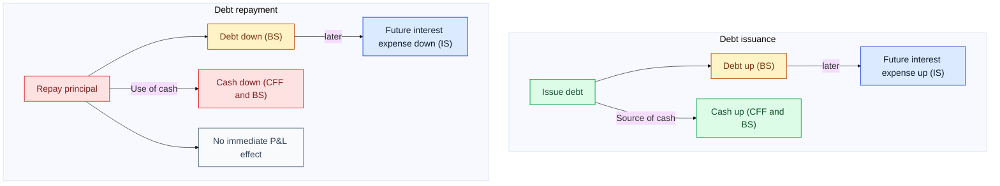
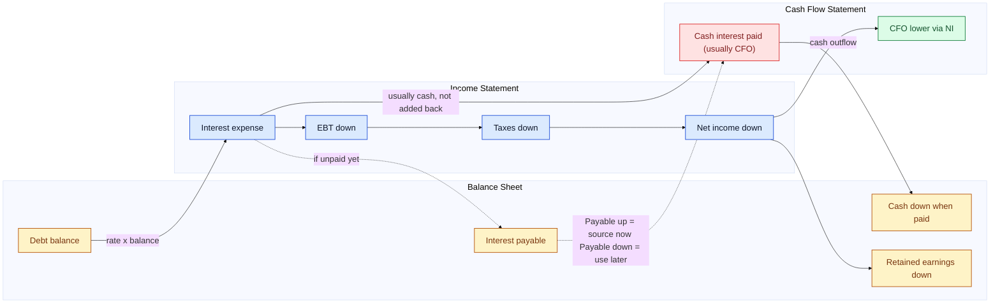
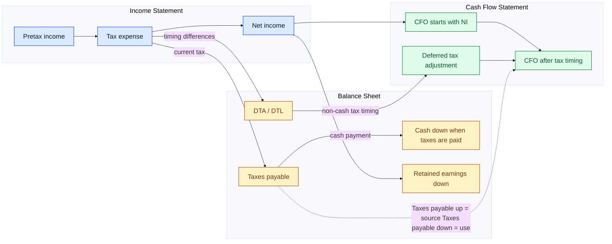

# Three-Statement Interview Diagrams

These diagrams use one sign convention throughout:

- Operating asset up = use of cash
- Operating asset down = source of cash
- Operating liability up = source of cash
- Operating liability down = use of cash

Color key used below:

- Blue = income statement
- Green = cash flow statement
- Amber = balance sheet
- Red = use of cash
- Mint = source of cash
- Gray = note or bridge item

## Vertical Three-Statement Reference

This is the big-picture view. Each statement is stacked vertically so you can see how net income rolls into cash flow and how ending cash and retained earnings land on the balance sheet.

```mermaid
%%{init: {'theme': 'base', 'themeVariables': {'fontSize': '24px'}, 'flowchart': {'htmlLabels': true, 'nodeSpacing': 60, 'rankSpacing': 90, 'useMaxWidth': true}} }%%
flowchart TD
  subgraph O_IS["Income Statement"]
    direction TB
    O_REV["Revenue"]
    O_COGS["Less COGS"]
    O_GP["Gross profit"]
    O_OPEX["Less OpEx"]
    O_EBITDA["EBITDA"]
    O_DA["Less D&A"]
    O_EBIT["EBIT"]
    O_INT["Less interest"]
    O_EBT["EBT"]
    O_TAX["Less taxes"]
    O_NI["Net income"]
    O_REV --> O_COGS --> O_GP --> O_OPEX --> O_EBITDA --> O_DA --> O_EBIT --> O_INT --> O_EBT --> O_TAX --> O_NI
  end

  subgraph O_CFS["Cash Flow Statement"]
    direction TB
    O_NI2["Net income"]
    O_NON["Add back D&A and other non-cash"]
    O_WC["Adjust delta NWC"]
    O_CFO["CFO"]
    O_CAPEX["CapEx"]
    O_CFI["CFI"]
    O_FIN["Debt and equity flows"]
    O_CFF["CFF"]
    O_NC["Net change in cash"]
    O_NI2 --> O_NON --> O_WC --> O_CFO --> O_CAPEX --> O_CFI --> O_FIN --> O_CFF --> O_NC
  end

  subgraph O_BS["Balance Sheet"]
    direction TB
    O_CASH["Cash"]
    O_OA["Operating assets"]
    O_PPE["PP&E"]
    O_OL["Operating liabilities"]
    O_DEBT["Debt"]
    O_RE["Retained earnings"]
    O_CASH --> O_OA --> O_PPE --> O_OL --> O_DEBT --> O_RE
  end

  O_NI -->|start CFS with NI| O_NI2
  O_NC -->|net change updates cash| O_CASH
  O_NI -.->|NI closes to RE| O_RE

  classDef is fill:#dbeafe,stroke:#1d4ed8,color:#0f172a,stroke-width:1.5px;
  classDef cfs fill:#dcfce7,stroke:#15803d,color:#14532d,stroke-width:1.5px;
  classDef bs fill:#fef3c7,stroke:#b45309,color:#78350f,stroke-width:1.5px;
  classDef note fill:#f8fafc,stroke:#64748b,color:#334155,stroke-width:1.5px;

  class O_REV,O_COGS,O_GP,O_OPEX,O_EBITDA,O_DA,O_EBIT,O_INT,O_EBT,O_TAX,O_NI is;
  class O_NI2,O_NON,O_WC,O_CFO,O_CAPEX,O_CFI,O_FIN,O_CFF,O_NC cfs;
  class O_CASH,O_OA,O_PPE,O_OL,O_DEBT,O_RE bs;

  style O_IS fill:#eff6ff,stroke:#1d4ed8,stroke-width:2px,color:#0f172a
  style O_CFS fill:#f0fdf4,stroke:#15803d,stroke-width:2px,color:#14532d
  style O_BS fill:#fff7ed,stroke:#b45309,stroke-width:2px,color:#78350f
```

## Scope Notes: What usually counts as CapEx and NWC?

`CapEx` and `delta NWC` are where interview answers often get sloppy. In a clean interview answer, define them explicitly: `CapEx` is capitalized operating investment in long-lived assets, and `operating NWC` is operating current assets minus operating current liabilities. Company definitions can vary, so it is good practice to state your scope before walking through the bridge.

Quick definitions:

- `Accounts receivable (AR)`: money customers owe the company because revenue was booked before cash was collected. It is an operating asset.
- `Accounts payable (AP)`: money the company owes suppliers or vendors because inventory or expense was booked before cash was paid. It is an operating liability.
- `Prepaids`: cash the company paid upfront for a future expense. It is an operating asset until the expense is recognized.
- `Accrued expenses`: expenses already recognized on the income statement but not yet paid in cash. They are operating liabilities.
- `Deferred revenue`: cash collected before the company recognizes the revenue. It is an operating liability until the revenue is earned.

Interview script:

- In interview shorthand, operating NWC usually means `AR + inventory + prepaids - AP - accrued expenses - deferred revenue`.
- I usually exclude cash, debt, marketable securities, and other non-operating items unless the case tells me otherwise.
- CapEx is capitalized spend on long-lived operating assets, not just any cash outflow.
- Typical CapEx includes PP&E, store or facility build-outs, equipment, and sometimes capitalized software.
- Routine repairs and maintenance usually stay in operating expenses, so they are not CapEx.
- In valuation, I may separate maintenance CapEx from growth CapEx if the question is about steady-state cash flow.
- If the company uses a different definition, I say the exact scope before walking through the cash flow bridge.

## A. How do you get from EBITDA to levered free cash flow?

EBITDA is an earnings proxy, not cash flow. To get to levered free cash flow, you move from operating profit before non-cash charges to actual cash left after taxes, interest, CapEx, working capital needs, and, if relevant, required debt paydown. For interview purposes, `CapEx` usually means capitalized operating investment, and `delta NWC` usually means the change in operating current assets and operating current liabilities, not every balance sheet current item.

Interview script:

- Start with EBITDA, which is before interest, taxes, and non-cash D&A.
- Subtract cash taxes and cash interest, because levered free cash flow is after both.
- Here, CapEx usually means capitalized operating spend like equipment, facilities, build-outs, and capitalized software.
- Subtract CapEx, because that is a real cash outflow even though it is not an immediate income statement expense.
- Then adjust for changes in net working capital: operating NWC usually means AR, inventory, prepaids, AP, accrued expenses, and deferred revenue.
- NWC up is a use of cash, NWC down is a source of cash, but I usually exclude cash, debt, taxes, and one-time items unless told otherwise.
- If the company has required debt amortization, subtract that too to get the cash left for equity.
- The equivalent bridge is net income plus D&A and other non-cash items, minus CapEx, minus or plus delta NWC, and minus required principal paydown.
- A common interview trap is calling EBITDA cash flow; it is only the starting point.

## B. How do you get from net income to cash from operations?

Under the indirect method, cash from operations starts with net income, then reverses non-cash items and timing differences. The goal is to turn accounting profit into cash generated by the core business in the period. The working capital adjustment here is usually `operating` working capital, not cash, debt, or financing items.

Interview script:

- Start with net income because the cash flow statement reconciles accounting earnings to cash.
- Add back non-cash expenses like depreciation, amortization, and other non-cash charges.
- Reverse non-operating gains or losses if they affected net income but belong somewhere else in cash flow.
- Then adjust for working capital timing items from the balance sheet, usually AR, inventory, prepaids, AP, accrued expenses, and deferred revenue.
- If operating assets go up, cash goes down; if they go down, cash goes up.
- If operating liabilities go up, cash goes up; if they go down, cash goes down.
- I usually do not include cash, debt, or other financing items in that operating NWC adjustment.
- The result is cash from operations, which is cash generated by the core business before investing and financing flows.

## C. How do changes in working capital flow through the 3 statements?

Working capital changes are timing differences between the income statement and actual cash movement. The balance sheet captures the asset or liability build, and the cash flow statement converts that change into a source or use of cash. In most interview settings, operating NWC means `AR + inventory + prepaids - AP - accrued expenses - deferred revenue`, while cash, debt, and most tax items are treated separately. `AR` means receivables from customers; `AP` means payables owed to suppliers. `Prepaids` are cash paid before expense recognition, `accrued expenses` are expenses recognized before cash payment, and `deferred revenue` is cash received before revenue recognition.

Interview script:

- Working capital is mostly about timing between the income statement and cash.
- AR is money customers owe you after you book revenue; it is an operating asset.
- AP is money you owe suppliers after you book inventory or expense; it is an operating liability.
- In interviews, I usually define operating NWC as AR, inventory, and prepaids minus AP, accrued expenses, and deferred revenue.
- For AR, up means you booked revenue but did not collect cash yet, so cash is down; down means collection, so cash is up.
- For inventory and prepaids, up means cash went out before the expense fully hit earnings, so that is a use of cash.
- For AP and accrued expenses, up means you recognized expense but have not paid cash yet, so that is a source of cash.
- For deferred revenue, up means you got cash before recognizing revenue, so cash is up even though revenue is still deferred.
- I usually exclude cash, debt, interest payable, and taxes payable from this operating NWC bucket unless the question defines it differently.
- The core sign rule is simple: operating asset up equals use, operating liability up equals source.
- A common trap is flipping the sign on AR or inventory; both are assets, so an increase consumes cash.

## D. How does depreciation affect the 3 statements?

Depreciation lowers accounting earnings but does not use cash in the current period. The key interview point is that it reduces EBIT and net income on the income statement, gets added back on the cash flow statement, and reduces net PP&E on the balance sheet.

Interview script:

- Depreciation is an expense on the income statement, so EBIT and net income go down.
- It is non-cash, so you add it back in cash from operations.
- That means depreciation does not reduce cash by itself in the current period.
- The real cash effect is the tax shield, because lower pretax income means lower cash taxes.
- On the balance sheet, net PP&E goes down because accumulated depreciation rises.
- Retained earnings also go down because net income is lower.
- The classic interview trap is saying depreciation is a cash expense; it is not.

## E. How does CapEx affect the 3 statements?

CapEx is a real cash outflow, but it is capitalized on the balance sheet rather than expensed immediately on the income statement. The income statement effect comes later through depreciation or amortization. In practice, CapEx often includes PP&E purchases, equipment, leasehold improvements, facilities build-outs, and sometimes capitalized software. It usually does not include routine repairs, which stay in operating expenses.

Interview script:

- CapEx is cash going out today, so it shows up as a use of cash in investing cash flow.
- CapEx usually includes long-lived operating investment like PP&E, equipment, build-outs, and sometimes capitalized software.
- It does not hit the income statement right away because you capitalize it on the balance sheet.
- Immediately, cash goes down and PP&E goes up.
- Over time, the asset is depreciated, and that depreciation reduces EBIT and net income.
- That later depreciation is non-cash, so it gets added back in CFO.
- Routine repairs usually stay in opex, and I may separate maintenance CapEx from growth CapEx in valuation work.
- The trap here is treating CapEx like an operating expense; it is not an immediate income statement item.

## F. How do debt issuance and debt repayment affect the 3 statements?

Debt principal flows through financing, not operations. Issuing debt brings in cash and raises the debt balance; repaying principal uses cash and lowers the debt balance. The income statement is affected later through interest expense, not by principal itself.

Interview script:

- New debt issuance is a financing inflow, so cash goes up and debt on the balance sheet goes up.
- There is no immediate operating income statement benefit from issuing debt.
- The income statement effect comes later because more debt usually means more interest expense.
- Debt repayment is the reverse: cash goes down and debt goes down.
- Principal repayment does not run through the income statement.
- Lower debt usually means lower future interest expense.
- A common trap is mixing up principal and interest; principal hits financing, interest hits earnings and usually CFO.

## G. How does interest expense affect the 3 statements?

Interest expense is an income statement item driven by the debt balance and interest rate. It lowers pretax income and net income, usually reduces CFO through cash interest paid, and does not by itself change the debt principal balance.

Interview script:

- Interest expense comes from the debt balance times the interest rate.
- It reduces EBT, which reduces taxes, and net income still falls on an after-tax basis.
- Because it is generally a real cash cost, you do not add it back like depreciation.
- Under the usual interview convention, cash interest paid sits in CFO.
- The debt principal balance does not change just because you recorded interest expense.
- If interest accrues but is not yet paid, interest payable goes up and cash is temporarily higher.
- The trap is saying debt goes down from interest expense alone; only principal repayment reduces debt.

## H. How do taxes flow through the 3 statements?

Tax expense on the income statement is not always equal to cash taxes paid. The balance sheet holds the timing difference in taxes payable and deferred tax accounts, and the cash flow statement reconciles accounting tax expense to actual cash paid.

Interview script:

- Start with pretax income, apply tax expense, and that gets you to net income.
- But tax expense is accounting tax, not always cash tax.
- The current unpaid portion sits in taxes payable on the balance sheet.
- If taxes payable goes up, you recognized expense but paid less cash, so that is a source of cash.
- If taxes payable goes down, you paid more cash than current expense, so that is a use of cash.
- Deferred tax assets and liabilities capture timing differences between book and tax accounting.
- On the cash flow statement, you adjust net income for those timing differences to get to actual cash taxes.
